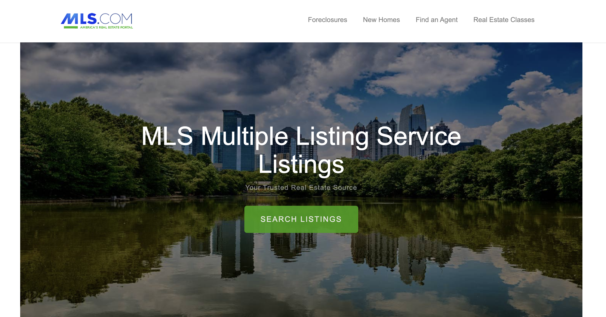
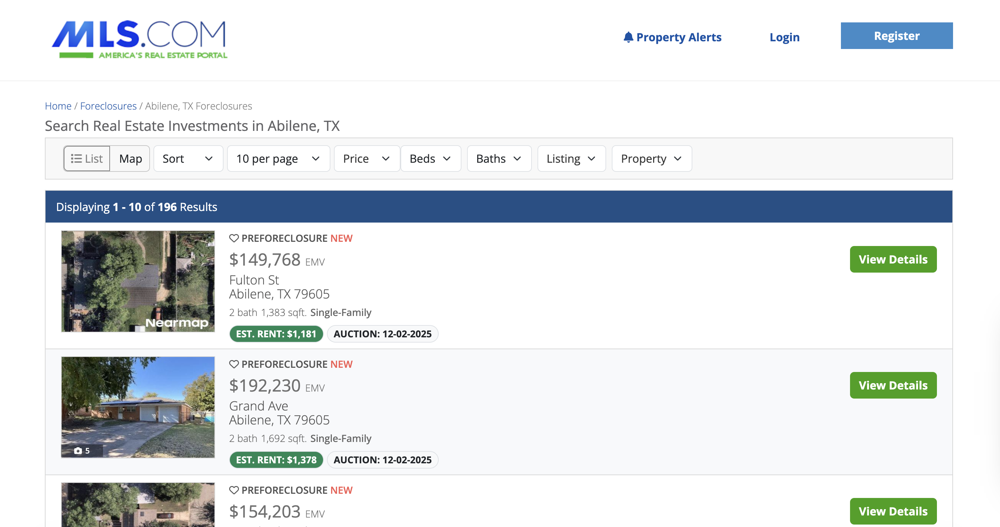
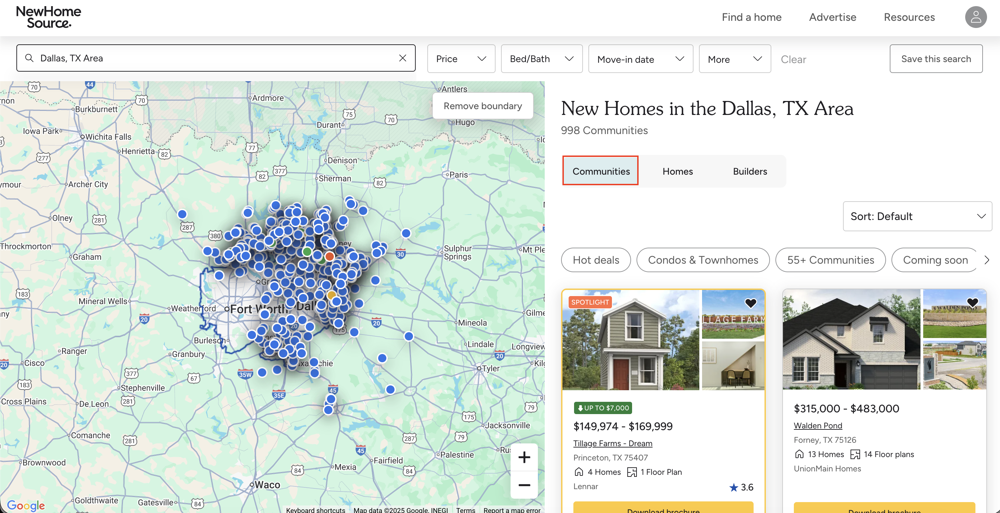
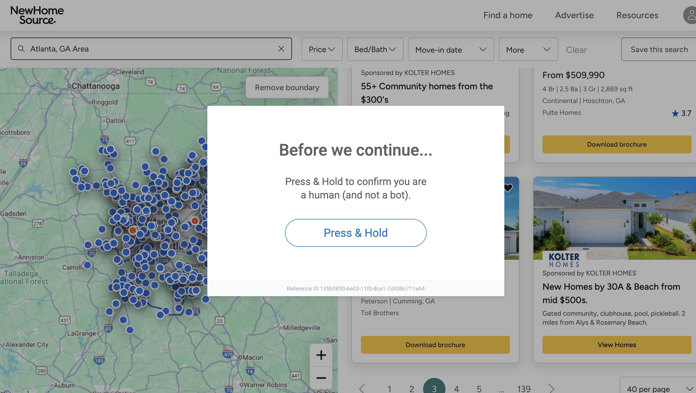
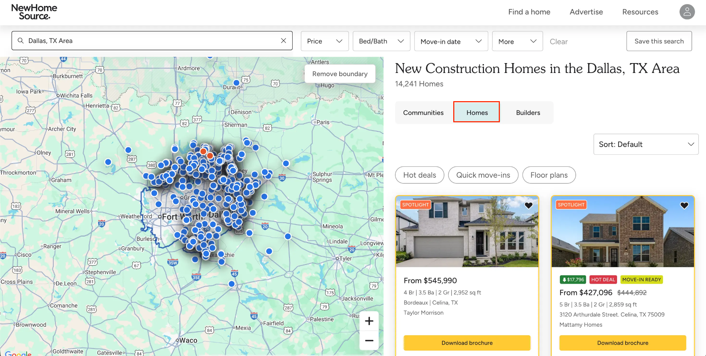

# MLS Real Estate Data Scraper
This repository provides Python scrapers to extract public real estate data from MLS portals. Accessing MLS-affiliated sites is difficult due to robust anti-bot defenses, including IP rate limiting, browser fingerprinting, and CAPTCHAs. The project uses an escalating strategy, from an HTTP scraper to a managed browser solution, to bypass these defenses and scale data extraction.



## Table of Contents

- [Why this data matters](#why-this-data-matters)
- [Installation](#installation)
- [Part 1 – The first scrape](#part-1--the-first-scrape-foreclosure)
- [Part 2 – Bypassing IP and browser blocks](#part-2--the-first-wall-bypassing-ip-and-browser-blocks)
- [Part 3 – Why local Playwright fails](#part-3--the-wall-why-local-playwright-fails)
- [Part 4 – Solving JavaScript and CAPTCHAs](#part-4--solving-javascript-and-interactive-captchas)
- [Choosing your path](#choosing-your-path--the-build-vs-buy-choice)

## Why this data matters

This public MLS data is the raw material for any serious real estate strategy. Teams use it to:

- **Analyze market trends.** Spotting pricing shifts, days-on-market, and inventory levels.
- **Build investment models.** Finding and evaluating foreclosure or new-build opportunities.
- **Run competitive intelligence.** Understanding what other builders and agencies are listing in real-time.

## The targets
- [mls.foreclosure.com](https://mls.foreclosure.com/) (for foreclosure listings)
- [newhomesource.com](https://www.newhomesource.com/) (for new community and home listings)

## Technical stack
- **Python 3.10+**
- **curl_cffi** – a Python client that impersonates browser TLS/JA3 fingerprints
- **BeautifulSoup 4** – for parsing static HTML
- **Playwright** – for automating browser actions and handling JavaScript-rendered content
- [**Bright Data**](https://brightdata.com/) – provides the unblocking infrastructure (residential proxies & Browser API) for scaling

## Installation

1. Clone the repository:
```bash
git clone https://github.com/brightdata/mls-scraper.git
cd mls-scraper
```

2. Install Python dependencies:
```bash
pip install -r requirements.txt
```

3. Install Playwright's browsers:
```bash
playwright install
```

4. Create your credentials file. Create a file named `.env` in the root of the project. We'll add credentials to this file in Parts 2 and 4.

## Part 1 – the first scrape (foreclosure)

We begin with a simple target, [mls.foreclosure.com](https://mls.foreclosure.com/), to get our first dataset and introduce our main HTTP library.

### The tool – curl_cffi
We'll use _curl_cffi_ for all our HTTP requests. While this first target is less complex, using *curl_cffi* from the start allows us to handle basic browser impersonation consistently. This powerful feature will be essential for our next target.

To learn more, you can read this [guide to web scraping with curl_cffi](https://brightdata.com/blog/web-data/web-scraping-with-curl-cffi).



Key snippet (*scrapers/foreclosures.py*):

```python
from curl_cffi import requests

def fetch_html(url):
    """
    Fetch HTML content using curl_cffi to impersonate a browser.
    """
    try:
        response = requests.get(
            url,
            timeout=30,
            impersonate="chrome", # The key to bypassing TLS fingerprinting
            verify=False
        )
        response.raise_for_status()
        return response.text
    # ... (error handling)
```

This script successfully handles pagination and extracts key details. See the [full script here](https://github.com/brightdata/mls-scraper/blob/main/scrapers/foreclosures.py).

### Usage
```bash
python3 scrapers/foreclosures.py \
  --url "https://mls.foreclosure.com/listing/search.html?ci=abilene&st=tx" \
  --max-pages 5 \
  --output data/foreclosure_data.json
```

To find your URL: Go to [https://mls.foreclosure.com](https://mls.foreclosure.com/), perform a search (e.g., "Abilene, TX"), and copy the URL from your browser.

Sample output (*data/foreclosures.json*):
```json
[
  {
    "listing_type": "Preforeclosure",
    "price": "$154,203",
    "price_type": "EMV",
    "street": "Meadowbrook Dr",
    "city": "Abilene",
    "state": "TX",
    "zip_code": "79603",
    "bathrooms": "2",
    "square_feet": "1,771",
    "property_type": "Single-Family",
    "estimated_rent": "$1,281",
    "auction_date": "01-06-2026",
    "listing_id": "64404928",
    "image_url": "https://dlvp94zy6vayf.cloudfront.net/listingphoto/..."
  }
]
```

See the [full sample output here](https://github.com/brightdata/mls-scraper/blob/main/data/foreclosures.json).

**Takeaway** – this script works perfectly for this simple site. Now, let's see what happens when we use this script on a more advanced target.

## Part 2 – the first wall (bypassing IP and browser blocks)
Now we target the "Communities" tab on *newhomesource.com*. This site is more advanced.



### The challenge – the IP and fingerprint wall
Running the script from Part 1 will fail immediately, as this site deploys multiple layers of protection:
1. **IP-based rate limiting.** After 2-3 requests, our single IP is flagged and blocked.
2. **Browser fingerprinting.** The server checks our TLS/JA3 network signature. A simple script is instantly identified as a bot.



### The solution – curl_cffi impersonation and Bright Data proxies
Here's how we solve this:
1. **Maintain browser impersonation.** Our *curl_cffi* script already uses `impersonate="chrome"`. This is crucial for bypassing the server's browser fingerprinting.
2. **Add residential proxies.** We'll integrate [Bright Data's residential proxy network](https://brightdata.com/proxy-types/residential-proxies) to rotate our IP address with every request, bypassing rate limits.

Set up your proxy zone:
- In your Bright Data dashboard, go to "Proxies and Scraping".
- Click "Get started" under "residential proxies".
- Name your zone (e.g., *mls_scraper_proxy*) and click "Add".
- Click the zone name to find your *Host*, *Port*, *Username*, and *Password*.

Add credentials to *.env*:
You can just open the *.env* file you created and add your proxy credentials.
```bash
# Bright Data Proxy Configuration
BRIGHTDATA_PROXY_HOST=brd.superproxy.io:port
BRIGHTDATA_PROXY_USER=your-proxy-username
BRIGHTDATA_PROXY_PASS=your-proxy-password
```

Key snippet (*scrapers/communities.py*):
```python
import os
from curl_cffi import requests
from dotenv import load_dotenv
load_dotenv() 

def fetch_html(url):
    # ...
    proxy_host = os.getenv('BRIGHTDATA_PROXY_HOST')
    # ...
    proxies = { 'https': proxy_url }
    try:
        response = requests.get(
            url,
            proxies=proxies,          # Solution 1: Add proxies
            timeout=30,
            verify=False,
            impersonate="chrome"      # Solution 2: Activate impersonation
        )
    # ...
```
See the [full script here](https://github.com/brightdata/mls-scraper/blob/main/scrapers/communities.py).

### Usage
```bash
python3 scrapers/communities.py \
  --url "https://www.newhomesource.com/communities/ga/atlanta-area" \
  --max-pages 10 \
  --output data/communities.json
```
To find your URL: Go to [newhomesource.com](https://www.newhomesource.com/), search for a city, and copy the URL.

Sample output (*data/communities.json*):
```json
[
  {
    "community_id": "201913",
    "community_name": "Hemingway - Reserve Series",
    "city": "Cumming",
    "state": "GA",
    "zip_code": "30041",
    "latitude": "34.279387",
    "longitude": "-84.070156",
    "price_low": "468033",
    "price_high": "585990",
    "builder_name": "Meritage Homes",
    "market_name": "Atlanta",
    "phone_number": "888-842-4527",
    "primary_image": "https://nhs-dynamic-secure.akamaized.net/...",
    "url": "https://www.newhomesource.com/community/ga/cumming/...",
    "num_homes": "8",
    "num_floor_plans": "7"
  }
]
```
See the [full sample output here](https://github.com/brightdata/mls-scraper/blob/main/data/communities.json).

**Takeaway** – this setup defeats IP and browser fingerprinting. But what happens when the site relies on JavaScript and interactive CAPTCHAs?

## Part 3 – the "wall" (why local Playwright fails)

Our HTTP scraper from Part 2 can't handle the "Homes" tab – it requires JavaScript and clicking buttons.

The logical next step, and the one most developers try, is to use a local Playwright browser with our residential proxies.

This is the "wall" we've been talking about.

We've included the script for this exact approach:
[scrapers/homes_proxy.py](https://github.com/brightdata/mls-scraper/blob/main/scrapers/homes_proxy.py)

**Go ahead and run it.**

You'll see it fails, and it's critical to understand *why*. The script will be immediately flagged and served an aggressive "Press and Hold" CAPTCHA.

This is the **browser-integrity problem.**

The server's anti-bot script doesn't care about your IP (that was the Part 2 problem). It's now analyzing your *browser's fingerprint*. It instantly detects the "tells" of a standard automation (webdriver flags, inconsistent fonts, GPU rendering, etc.) and blocks you before you can scrape anything.

This is why a local Playwright script, even with a great proxy, is a dead end for this target.

Now, let's solve this final wall.

## Part 4 – Solving JavaScript and Interactive CAPTCHAs

We now target the most difficult section: the "Homes" tab on *newhomesource.com*.



### The solution – the Bright Data Browser API
The [Bright Data Browser API](https://brightdata.com/products/scraping-browser) is designed to solve this exact browser-integrity problem.

It's not just Playwright-on-a-proxy, it's a managed, cloud-based browser that's built to appear human at the fingerprint level. It automatically manages all the low-level inconsistencies we mentioned (the `webdriver` flags, fonts, GPU rendering, etc.) and integrates unblocking before the request is ever made.

This is why we can connect to it and use a standard Playwright script, while the API handles all the complex unblocking and CAPTCHA solving in the background.

Set up your Browser API zone:

- Follow the [Browser API quickstart guide](https://docs.brightdata.com/scraping-automation/scraping-browser/quickstart) to create a new Browser API zone.
- Once created, click the zone name to find your *Host*, _Port_, *Username*, and *Password*.

Add credentials to *.env*:

Open your *.env* file and add these new credentials.
```bash
# ... (Proxy credentials from Part 2)

# Bright Data Browser API Configuration
BRIGHTDATA_BROWSER_HOST=brd.superproxy.io:port
BRIGHTDATA_BROWSER_USER=your-browser-username
BRIGHTDATA_BROWSER_PASS=your-browser-password
```

Key snippet (*scrapers/homes_browser.py*):

This script uses the standard Playwright API. The only difference is that instead of launching a local (detectable) browser, we use *connect_over_cdp* to connect to Bright Data's remote, unblockable browser.
```python
import os
from playwright.sync_api import sync_playwright
from dotenv import load_dotenv

load_dotenv()

def scrape_all_pages(base_url, max_pages=None):
    # ...
    
    # Load Browser API credentials
    browser_host = os.getenv('BRIGHTDATA_BROWSER_HOST')
    browser_user = os.getenv('BRIGHTDATA_BROWSER_USER')
    browser_pass = os.getenv('BRIGHTDATA_BROWSER_PASS')
    
    auth = f"{browser_user}:{browser_pass}"
    brd_connection_string = f"wss://{auth}@{browser_host}"

    with sync_playwright() as p:
        try:
            logger.info("Connecting to Bright Data Browser API...")
            # Connect to the remote, unblockable browser
            browser = p.chromium.connect_over_cdp(
                brd_connection_string,
                timeout=60000
            )
            
            # --- From here, it's just standard Playwright automation ---
            context = browser.new_context(ignore_https_errors=True)
            page = context.new_page()

            page.goto(base_url, wait_until="domcontentloaded", timeout=60000)

            # 1. Click the "Homes" tab
            page.click('a[data-qa="filters-result-type-homes"]')
            
            # ... (parsing logic) ...
            
            # 2. Loop through all pages by clicking "Next"
            for page_num in range(2, total_pages + 1):
                page.click('button[data-next]') # <-- AUTOMATION
                # ...
```

See the [full script here](https://github.com/brightdata/mls-scraper/blob/main/scrapers/homes_browser.py).

### Usage
```bash
python3 scrapers/homes_browser.py \
  --url "https://www.newhomesource.com/communities/ga/atlanta-area#home-listings" \
  --max-pages 5 \
  --output data/homes_browser.json
```

To find your URL: Go to [newhomesource.com](https://www.newhomesource.com/), search for a city, click the "Homes" tab, and copy the URL.

Sample output (*data/homes_browser.json*):
```json
[
  {
    "plan_id": "3180088",
    "listing_type": "plan",
    "community_name": "Rosewood Farm",
    "plan_name": "Reynolds",
    "builder_name": "Taylor Morrison",
    "city": "Lawrenceville",
    "state": "GA",
    "zip_code": "30044",
    "price_raw": "$424,990",
    "home_status": "Ready to build",
    "bedrooms": "4",
    "bathrooms": "3.5",
    "garages": "2",
    "sq_ft": "2375",
    "url": "https://www.newhomesource.com/plan/reynolds-taylor-morrison-..."
  }
]
```

See the [full sample output here](https://github.com/brightdata/mls-scraper/blob/main/data/homes_browser.json).

## Choosing your path – the "build vs. buy" choice

For teams that want to focus on data analysis rather than scraper maintenance, Bright Data offers two managed paths.

### 1. The low-code path – Web Scraper IDE
For developers who want to write the parsing logic (in JavaScript) but offload all infrastructure, proxy management, and unblocking. The [Web Scraper IDE](https://brightdata.com/products/web-scraper/functions) is a cloud-based, serverless environment where Bright Data handles all the scaling, scheduling, and unblocking for you.

### 2. The no-code path – request a custom scraper
For teams or individuals who just want the final, clean data. You can [request a custom scraper](https://brightdata.com/products/web-scraper/custom), and the Bright Data team will build, run, and maintain the scraper for you, delivering the data on your schedule.

Here's a final breakdown to help you choose the right solution for your project:

| | Part 1: simple scrape | Part 2: IP/browser blocks | Part 4: JS/CAPTCHA wall | The managed path (buy) |
| --- | --- | --- | --- | --- |
| Tool used | *curl_cffi* | *curl_cffi* + [residential proxies](https://brightdata.com/proxy-types/residential-proxies) | *Playwright* + [Browser API](https://brightdata.com/products/scraping-browser) | [Web Scraper IDE](https://brightdata.com/products/web-scraper/functions) / [custom scraper](https://brightdata.com/products/web-scraper/custom) |
| Target site | *mls.foreclosure.com* | *newhomesource.com* (Communities) | *newhomesource.com* (Homes) | Any website |
| Handles JS rendering | ❌ | ❌ | ✅ (Automatic) | ✅ (Managed) |
| Solves CAPTCHAs | ❌ | ❌ | ✅ (Automatic) | ✅ (Managed) |
| Bypasses IP blocks | ❌ | ✅ | ✅ | ✅ (Managed) |
| Activates impersonation | ❌ | ✅ | ✅ | ✅ (Managed) |
| Maintenance effort | Low | Medium | Constant | None |
| Technical skill | Medium | Medium | High | None |

## Further Reading

The real estate data vertical has unique challenges. To explore this topic further, see these additional guides:

- [How to scrape Zillow: a full technical guide](https://brightdata.com/blog/web-data/how-to-scrape-zillow)
- [How Big Data Is Transforming Real Estate](https://brightdata.com/blog/leadership/how-big-data-is-transforming-real-estate)
- [Build a Real Estate AI Agent with CrewAI & Bright Data](https://brightdata.com/blog/ai/crewai-real-estate-agent)
- [A comparison of the Best Real Estate Data Providers](https://brightdata.com/blog/web-data/best-real-estate-data-providers)

## What's next?

- **For developers.** Fork the repo and see what it takes to adapt these scripts. The real challenge isn't the code, it's the constant unblocking and maintenance.
- **For data team leaders.** Let your team parse, not patch. The [Web Scraper IDE](https://brightdata.com/products/web-scraper/functions) is a cloud environment where you just write the logic. Bright Data handles the unblocking, CAPTCHAs, and infrastructure.
- **For users who just need data.** Skip the development entirely. You can [request a custom dataset](https://brightdata.com/products/web-scraper/custom) and receive a clean, ready-to-use data feed delivered.
